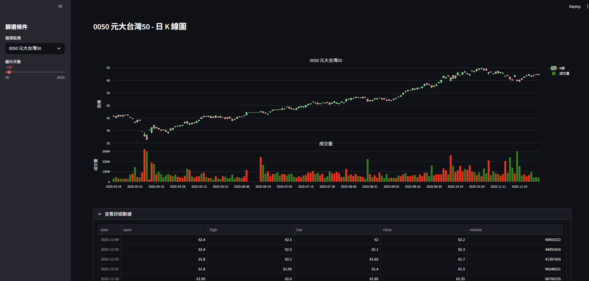

# 台股 K 線可視化儀表板

這是一個基於 Python Streamlit 開發的股票分析工具，串接本地 MySQL 資料庫，提供互動式的日 K 線圖與成交量分析。

## 專案截圖

## 功能特色

1. **互動式 K 線圖**
   - 使用 Plotly 繪製，支援滑鼠懸停顯示詳細開高低收資訊。
   - 十字準線 (Crosshair) 輔助對齊查看數據。
   - 支援圖表縮放 (Zoom in/out) 與平移。

2. **優化圖表顯示**
   - **無縫時間軸**：將日期視為類別處理，自動隱藏週末與非交易日的空白間隙。
   - **成交量鎖定**：成交量圖表高度固定，縮放時間軸時不會導致成交量柱狀圖比例跑掉。
   - **中文支援**：介面與圖表皆已設定支援繁體中文顯示。

3. **資料篩選**
   - 側邊欄選單可直接從資料庫讀取股票清單。
   - 可自訂顯示的歷史天數範圍。

## 技術與套件

- **語言**: Python 3.x
- **網頁框架**: Streamlit
- **繪圖核心**: Plotly
- **資料處理**: Pandas
- **資料庫**: MySQL

## 安裝與執行

1. 安裝必要套件：
   
   pip install streamlit pandas plotly sqlalchemy mysql-connector-python

2. 設定資料庫連線。

3. 啟動應用程式：

   streamlit run stock_dashboard.py
